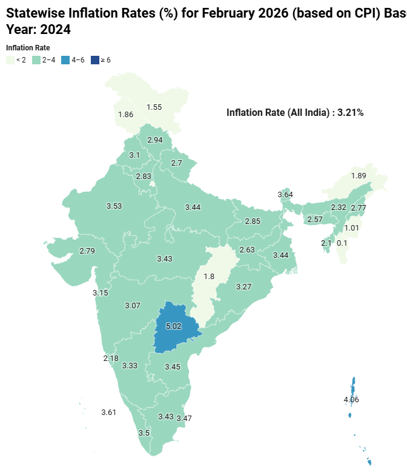

# Silent Inflation Detector

> **Your inflation rate. Not the government's average.**

India's official CPI is a single national number — but inflation is not experienced equally. This app computes *your* personal inflation rate, weighted against your actual spending mix using RBI/MOSPI CPI Urban data.

---

## Motivation

### Even states disagree — imagine households

In February 2026, state-level CPI data revealed a stark picture:

| | Inflation Rate |
|---|---|
| 🇮🇳 **All India Average** | 3.21% |
| 📍 **Telangana (Hyderabad)** | **5.02%** |



Someone in Hyderabad was experiencing **57% more inflation** than the headline national number suggested. The single All India figure of 3.21% would have told them their cost of living was under control — but their reality was 5.02%.

> *"Even at a state level, Telangana's inflation is 57% higher than the national average. Imagine how much more it varies at an individual household level — that's exactly what this app computes."*

If geography alone causes this divergence, then a household that spends heavily on food and rent (rather than clothing or transport) will experience a completely different inflation reality than the national basket assumes.

---

## How It Works

The government computes CPI using **fixed average weights** across all Indian households:

| Category | RBI CPI Urban Weight |
|---|---|
| Food & Beverages | 45.86% |
| Miscellaneous | 28.32% |
| Housing | 10.07% |
| Transport & Communication | 7.37% |
| Clothing & Footwear | 6.53% |
| Health | 5.89% |
| **Entertainment** | ❌ Not tracked |

This app replaces those fixed weights with **your actual spend share** — so if you spend 60% on food, food's CPI inflation gets 60% weight in your number, not 45.86%.

### Formula

```
Personal Inflation = Σ (your_spend_share_i × CPI_YoY_inflation_i)
```

---

## Features

- 📊 **Personal inflation rate** — weighted against your actual spend mix
- 📈 **Trend chart** — your rate vs national CPI over time
- 🔮 **Spending forecasts** — Simple Exponential Smoothing with linear regression fallback
- 🚨 **Anomaly detection** — Z-score and Isolation Forest
- 💡 **Insight cards** — automated analysis of drivers and risks
- ⚑ **Entertainment flag** — highlights spending the government doesn't track
- 🎛️ **What-If simulator** — see how a 20% cut in food spending changes your rate

---

## Stack

| Layer | Technology |
|---|---|
| Backend | FastAPI (Python) + SQLite |
| Frontend | Next.js 14 + TypeScript + Tailwind CSS |
| ML | statsmodels (SES), scikit-learn (IsolationForest, LinearRegression) |
| CPI Data | MOSPI CPI Urban — Base Year 2012 |

---

## Running Locally

**Backend** (port 8000):
```bash
cd backend
pip install -r requirements.txt
python scripts/generate_mock_cpi.py   # one-time: generates CPI data
python -m uvicorn main:app --reload --port 8000
```

**Frontend** (port 3000):
```bash
cd frontend
npm install
npm run dev
```

Open **http://localhost:3000**

---

## Using Real CPI Data

The app ships with simulated CPI data for development. To use real MOSPI data:

1. Download **CPI Urban** from [mospi.gov.in](https://mospi.gov.in) → Statistics → CPI
2. Format it with these exact columns:
   ```
   Year, Month, General, Food_Beverages, Housing, Transport_Communication, Clothing_Footwear, Health, Miscellaneous
   ```
3. Replace `backend/data/cpi_data.csv`
4. Restart the backend

---

## API Endpoints

| Method | Endpoint | Description |
|---|---|---|
| `GET` | `/health` | Health check + CPI status |
| `POST` | `/spending/` | Submit monthly spending |
| `POST` | `/spending/batch` | Submit multiple months of spending in one request |
| `GET` | `/spending/` | Fetch spending history |
| `GET` | `/inflation/history/all` | Personal inflation for all months |
| `GET` | `/inflation/national/{month}` | National CPI for a month |
| `GET` | `/forecast/{category}` | 6-month spending forecast |
| `GET` | `/anomaly/` | Anomaly detection (`auto`, `zscore`, `isolation_forest`) |
| `GET` | `/insights/` | Auto-generated insight cards |
| `POST` | `/whatif/` | What-If simulation |

---

*CPI Urban — Base Year 2012. Source: MOSPI (mospi.gov.in). Do not substitute with CPI Rural or CPI Combined.*
